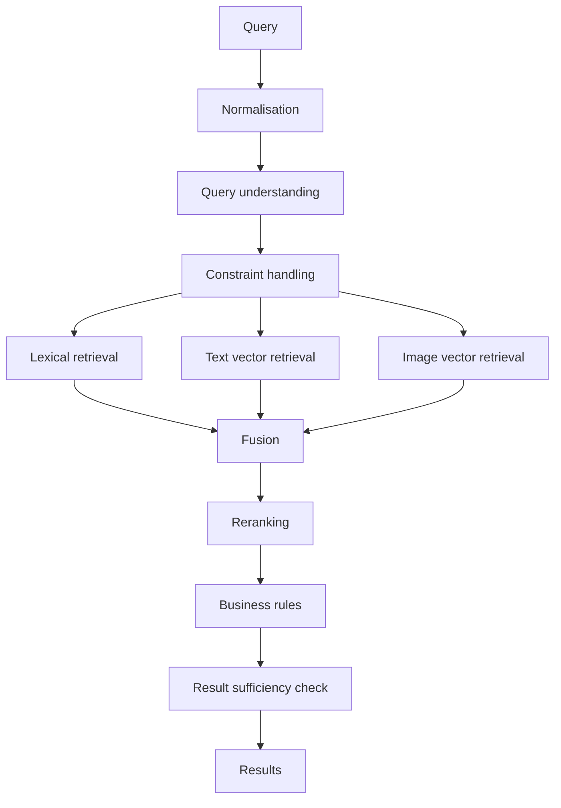
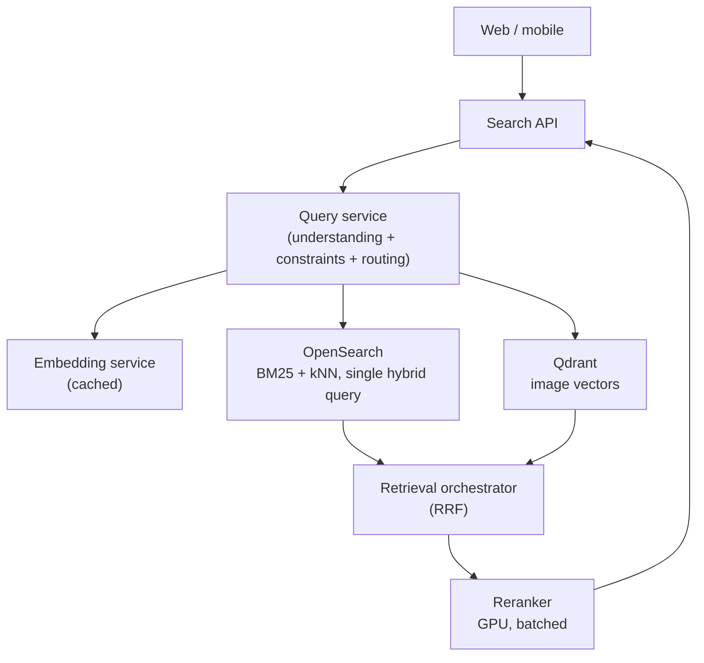

# Your search pipeline needs two diagrams, not one

Most hybrid search design discussions I've been in stall in the same place, and it usually takes a while to notice why.

Someone draws the pipeline on a whiteboard. Query understanding, lexical retrieval, vector retrieval, fusion, reranking. Sensible boxes, sensible arrows. Then someone points out that the search engine can already do hybrid retrieval natively, so the fusion box is redundant. Someone else says that if fusion happens inside the engine we lose the ability to tune it. A third person asks whether query understanding should really be its own service given the latency budget.

Every one of those points is reasonable. The problem is that they are answers to three different questions, and the diagram on the whiteboard is pretending to be the single source of truth for all of them.

The diagram is doing two jobs at once: describing **what the system computes** and describing **what actually runs**. Those are different artefacts with different lifespans, and collapsing them is why the conversation goes in circles.

## The question worth separating out

Here is the split I now insist on before any architecture discussion about search:

> **Logical:** what is this pipeline supposed to compute, and what property does each stage guarantee?
>
> **Physical:** what processes, engines and network calls implement that computation, and what did we merge or optimise to make it fast enough and cheap enough?

The useful reframing is that a logical search pipeline is not really an architecture diagram at all. It's **a distributed algorithm**. It has inputs, outputs, intermediate cardinalities, an ordering that matters, and correctness properties you can state and test. That it happens to run across several machines is an implementation detail of the algorithm, not the point of it.

Once you see it that way, the physical architecture becomes what it actually is: a set of optimisations applied to that algorithm, each of which has to preserve the algorithm's guarantees or explicitly declare which one it's giving up.

Let me work through a real query.

## The concrete case

Take a property search system and the query:

```text
"3 bedroom house near the beach under $2m"
```

This query is a good stress test because it mixes three different kinds of signal. `3 bedroom` and `under $2m` are structured constraints with exact semantics. `house` is a category. `near the beach` is a fuzzy semantic notion that could be geographic, could be a lifestyle descriptor, and probably means something slightly different to every user who types it.

A first pass at the logical pipeline:



So far this is just boxes. The boxes only become an algorithm when each one carries a contract. That's the part most diagrams skip, and it's where nearly all the value is:

| Stage                  | Input                    | Output                                              | Cardinality  | Property it owns                                    |
| ---------------------- | ------------------------ | --------------------------------------------------- | ------------ | --------------------------------------------------- |
| Query understanding    | Raw text                 | Structured constraints + residual free text         | 1 → 1        | Never invents a constraint the user didn't express  |
| Constraint handling    | Constraints              | Hard filters + soft preferences + relaxation policy | 1 → 1        | Hard constraints are never silently violated        |
| Lexical retrieval      | Free text + filters      | Scored candidates                                   | 1 → k₁       | High precision on exact term matches                |
| Text vector retrieval  | Embedded query + filters | Scored candidates                                   | 1 → k₂       | Recall on paraphrase and intent                     |
| Image vector retrieval | Embedded query + filters | Scored candidates                                   | 1 → k₃       | Recall on visual attributes absent from text        |
| Fusion                 | Three ranked lists       | One ranked list                                     | k₁+k₂+k₃ → n | Combines lists without assuming score comparability |
| Reranking              | Query + n candidates     | Reordered candidates                                | n → n        | Improves top-of-list ordering                       |
| Result sufficiency     | Ranked results           | Results, or a relaxation signal                     | n → m        | Zero-result queries are detected and handled        |

Now it's an algorithm. Every row is testable in isolation, and every row can be wrong in a way you can name.

## The decisions that live in the logical diagram

The thing I want to push back on is the assumption that logical architecture is the easy, hand-wavy part you rush through to get to the real engineering. Some of the hardest calls in a search system are purely logical, and they're much cheaper to argue about before anyone has written a deployment manifest.

**Is `near the beach` a constraint or a signal?**

If you treat it as a constraint, query understanding resolves it to a geographic boundary and it becomes a hard filter. Precision goes up. You also produce zero results for the user who would have been delighted by a place eight hundred metres inland, and you've committed to maintaining a definition of "beach proximity" that will be wrong in half your markets.

If you treat it as a signal, it stays in the residual free text, flows into the vector retrieval stages, and influences ranking rather than membership. Recall goes up, and so does the risk of returning something forty kilometres from the water because the listing description mentioned a "coastal feel".

There's a third option, which is that it's both: a soft geographic preference that boosts rather than filters. That option only exists if your constraint handling stage has a notion of soft constraints, which is a logical design decision that shapes everything downstream.

No product choice helps you here. This is a question about what the algorithm means.

**Do filters apply before or after candidate selection?**

This one looks like an implementation detail and isn't. If `price <= 2000000` is applied _after_ vector retrieval returns its top 50, and the query happens to sit in an expensive part of the embedding space, you can get zero results back from a stage that was supposed to return 50 candidates. The cardinality contract in the table above quietly breaks.

Logically, the correct statement is: **hard constraints are applied before candidate selection so that requested candidate counts are preserved.** That's an algorithmic requirement. How you honour it in an approximate nearest neighbour index, where filtered search interacts awkwardly with graph traversal, is a physical problem, and often a genuinely hard one. But the requirement comes first, and having it written down is what stops the physical implementation from silently changing the meaning of the pipeline.

## What the physical architecture is allowed to change

Now the same pipeline, implemented:



Count the boxes. The logical diagram had nine stages; this has six runtime components. Three merges happened:

1. Query understanding, constraint handling and retrieval routing collapsed into one service. They share state, they run in sequence, and separating them buys you two network hops you can't afford in a 300 ms budget.
2. Lexical retrieval, text vector retrieval and part of fusion collapsed into a single OpenSearch query, because the engine can do both and doing them in one round trip is meaningfully faster.
3. Business rules and result sufficiency moved into the API layer, because that's where the response is assembled anyway.

None of these merges are wrong. They're the entire reason physical architecture exists. But they're only safe under one condition, and this is the test I'd apply to every merge:

> **After the merge, can you still state each logical stage's contract, and can you still measure whether it holds?**

Merge two, in particular, deserves scrutiny. Fusion has now disappeared inside the search engine. If relevance regresses next month, can you attribute it to lexical retrieval, vector retrieval, or the way they were combined? If the engine's hybrid scoring is a black box with one tuning knob, you've traded an observability property for a latency win. That might be exactly the right trade. It's only a bad trade when nobody noticed they made it.

The failure mode runs in the other direction too, and I see it about as often. A team writes a clean logical pipeline, then implements it literally: nine boxes, nine services, nine sets of retries and timeouts, and a p99 that no amount of tuning will rescue. The logical diagram is not a deployment plan and it is not an org chart. Treating it as either is how you end up paying microservice tax on an algorithm that would have been happier as one process.

## The bridge between them

The artefact that reconciles the two diagrams is a runtime trace of a single request, annotated with the numbers:

```text
request
  ↓  parse + understand query            12 ms
  ↓  embed query (cache hit 60%)          8 ms
  ↓  parallel retrieval
     ├── OpenSearch hybrid   k=100       22 ms
     └── Qdrant image        k=50        18 ms
  ↓  RRF over 150 candidates              2 ms
  ↓  rerank top 100                      45 ms
  ↓  business rules + sufficiency         3 ms
  ↓  return top 20                     ~ 95 ms
```

This is where the two views meet. The candidate counts (`k=100`, `top 100`, `top 20`) belong to the logical algorithm. The milliseconds and the cache hit rate belong to the physical implementation. Putting them on one page is what lets you ask the questions that actually matter: is the reranker earning its 45 ms, and would reranking 50 candidates instead of 100 cost us anything measurable in nDCG?

For search systems specifically, I'd argue this runtime view is more operationally useful than either static diagram on its own, because it's the only one that shows parallelism, fan-out, candidate attrition and fallback paths together.

## Where I'd land

The mental model I'd suggest:

**The logical pipeline is the claim you're making about relevance.** It's a distributed algorithm with stage contracts, cardinalities and correctness properties. It should be expressible without naming a single product. If you can't describe a stage without saying "OpenSearch", it isn't a logical stage yet, it's a physical one wearing a disguise.

**The physical architecture is a set of optimisations over that algorithm.** Every merge, every co-location, every cache is a trade. Each one should come with a sentence saying what it bought and what it cost, and the cost is usually observability rather than correctness.

A few heuristics that follow from that:

- Write the stage contract table before drawing boxes. Boxes without contracts generate opinions; contracts generate decisions.
- Keep candidate counts in the logical spec. They're algorithmic parameters, not tuning knobs someone can change in a config file without telling anyone.
- When a design review disagreement gets stuck, ask which diagram the objection is about. About half the time the two people agree on the algorithm and are arguing about deployment, or the reverse.
- Preserve one metric per logical stage even after physical merges. If fusion is inside the engine, you still want lexical-versus-vector contribution in your telemetry.

Where does this break down? On small systems. If you have one service and one search engine, the two diagrams are nearly the same diagram and the ceremony isn't worth it. It also breaks down during genuine exploration, when you don't yet know whether reranking helps enough to justify existing. Separate the views once the pipeline has more than about five stages, or once more than one team owns part of it.

The version I'd want on a wall is four diagrams, not one: capabilities, logical pipeline, annotated runtime trace, and physical deployment. Those four tend to expose the decisions that matter without generating documentation nobody maintains.

But if you only take one thing: relevance bugs live in the logical diagram, and latency and cost bugs live in the physical one. Knowing which diagram you're looking at is most of the debugging.
