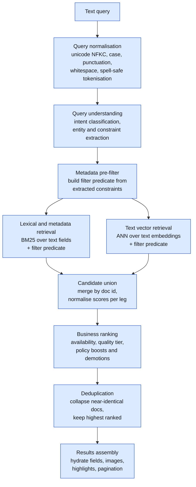
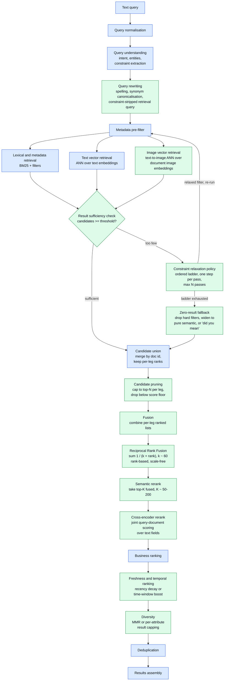
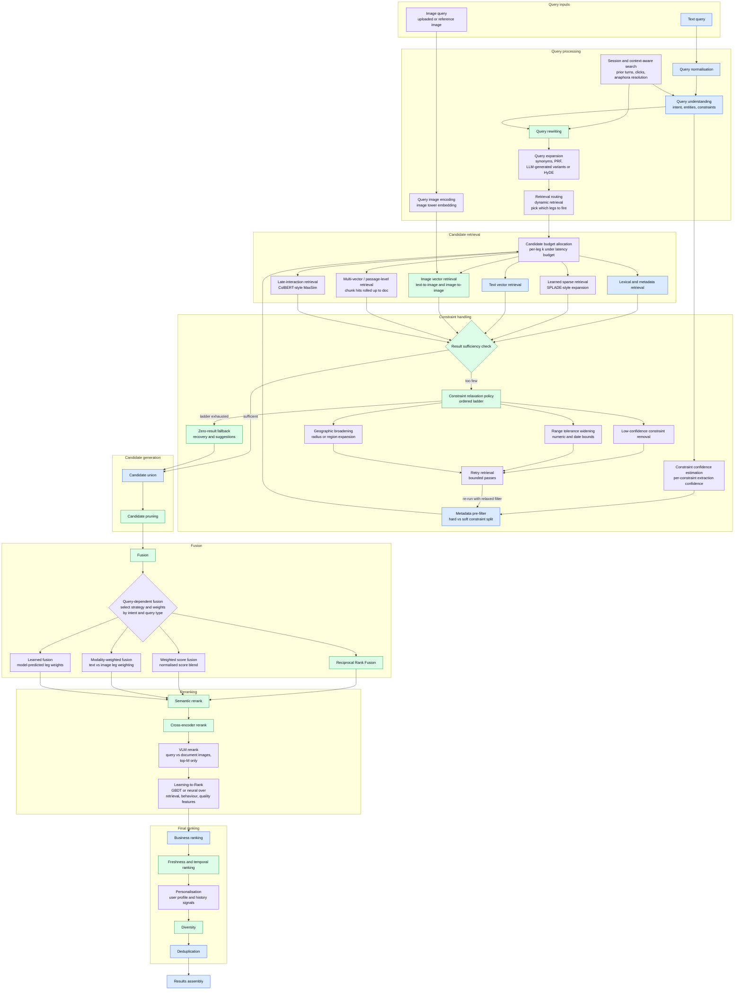

# Search Query Pipeline Diagrams

https://claude.ai/chat/c3bc1980-cd77-4d70-89a4-8014c9e5d175

# Hybrid Multimodal Query Search Pipelines

Three progressive reference templates for a query-time search pipeline over a corpus where each
document has text fields, textual/numeric metadata, and an associated set of images.

**Assumed offline/indexing state (out of scope here):**

- Lexical + metadata index (BM25 / filterable fields) already built
- Vector index with text embeddings (document/passage level) already built
- Vector index with image embeddings in a shared or bridged space with the text encoder
- Optional: learned sparse (SPLADE-style) and multi-vector (ColBERT-style) indexes

**Legend used in all diagrams:**

| Style  | Meaning                                                    |
| ------ | ---------------------------------------------------------- |
| Blue   | `core` — minimum viable pipeline                           |
| Green  | `recommended` — expected in a competent production system  |
| Purple | `optional` — added for quality, scale, or specific domains |

---

## 1. Core only

The smallest pipeline that is still genuinely hybrid: one lexical leg, one dense leg, a naive
union, and business rules applied on top.

**Notes**

- With no fusion stage, `Candidate union` must do the merging itself. The usual minimum is
  min-max or z-score normalisation per leg, then a fixed weighted sum. This is the weakest link
  in the core pipeline and the first thing diagram 2 replaces.
- The pre-filter is applied _inside_ both retrievers, not after them. Post-filtering a top-k ANN
  result set silently collapses recall when the filter is selective.
- No sufficiency check here means an over-constrained query returns zero results with no recovery.

---

## 2. Core + recommended

Adds query rewriting, cross-modal image retrieval, a constraint relaxation loop, principled rank
fusion, a rerank stage, and freshness/diversity in the final ranking.

**Notes**

- `Image vector retrieval` here is cross-modal: the _text_ query is encoded with the image model's
  text tower (CLIP/SigLIP-style) and matched against document image embeddings. No image input
  is required for this leg to be useful.
- The relaxation loop deliberately re-enters at `Metadata pre-filter` rather than at retrieval,
  because relaxation changes the filter predicate. Cap passes (2 is typical) and always tag the
  response so the UI can say "showing broader results".
- RRF is the default fusion choice because it needs no score calibration across legs — lexical
  BM25 scores and cosine similarities are not comparable, and score-based fusion requires
  per-corpus tuning that RRF avoids.
- Rerank depth is the main latency dial. Cross-encoding 100 candidates is roughly 10x the cost of
  fusion; budget for it explicitly.

---

## 3. Core + recommended + optional

Full surface area. Most systems will only ever enable a subset of the purple nodes — treat this as
the menu, not the target.

**Notes**

- `Query-dependent fusion` is drawn as a selector over the other fusion strategies rather than a
  parallel strategy, because in practice it is the policy layer that picks RRF vs weighted vs
  modality-weighted per query class. `Learned fusion` replaces the hand-tuned weights in that
  same slot.
- `Constraint confidence estimation` feeds the pre-filter so constraints can be split into hard
  (high confidence, applied as filters) and soft (low confidence, applied as ranking boosts). This
  is what makes `Low-confidence constraint removal` cheap — the relaxation ladder just promotes
  soft constraints out of the filter.
- Relaxation ladder order matters and is domain-specific. A common ordering is: low-confidence
  constraints first, then numeric/date tolerance, then geography, since geographic broadening
  usually degrades perceived relevance the most.
- `VLM rerank` is expensive enough that it should only see the top 10-20 candidates, and usually
  only when the query has visual intent or an image input is present.
- `Late-interaction retrieval` can equally be positioned as a rerank stage over fused candidates
  rather than a first-stage retriever. Placement depends on whether you maintain a ColBERT-style
  index or only score on demand.
- Deduplication appears last to match the component ordering given, but exact-duplicate collapse
  by content hash is usually cheaper at `Candidate union`; near-duplicate collapse stays here.

---

## Cross-cutting concerns (not stages)

Worth reserving space for when you expand these templates:

- **Timeouts and partial results** — each retrieval leg needs an independent deadline; the pipeline
  should degrade to whichever legs returned rather than failing the request.
- **Caching** — query understanding/rewriting output, query embeddings, and rerank scores all cache
  well at different TTLs.
- **Observability** — per-stage candidate counts and latencies, relaxation-pass counters, and
  per-leg contribution to the final top-10 are the metrics that make regressions debuggable.
- **Offline evaluation hooks** — the fusion and rerank stages are where you want deterministic
  replay against a labelled set.
