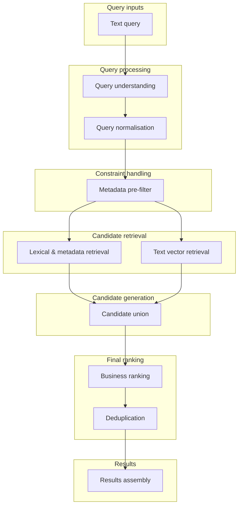
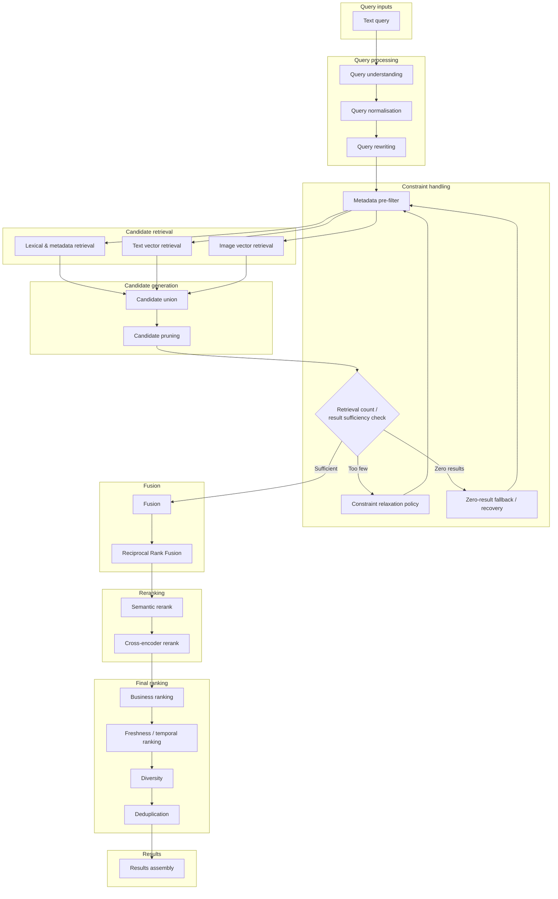
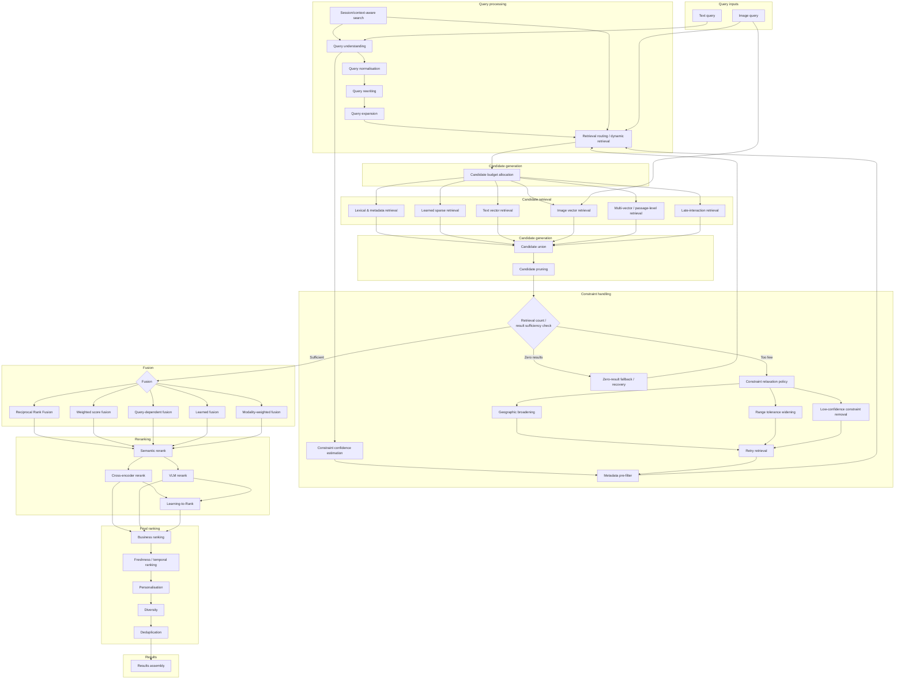

# Search Query Pipeline Diagrams

https://chatgpt.com/c/6a880532-f940-83ec-bddc-d7e8fb97d080

Below are three progressively richer **query-time reference architectures**. Indexing, embedding generation and ingestion are intentionally excluded.

Two assumptions are worth making explicit:

- **Image vector retrieval can be driven by a text query** when text and images share a multimodal embedding space, so it appears in diagram 2 even though `Image query` itself is optional.
- In the full pipeline, many optional components are **alternative strategies**, not steps that must all execute for every query. Retrieval routing decides which paths to activate.

## 1. Core only

This is the minimum viable modern hybrid search pipeline: understand and normalise the query, apply hard metadata constraints, retrieve lexical and semantic candidates in parallel, union them, then apply business ranking and deduplication.



Conceptually:

```text
Query
  → understand / normalise
  → constrain
  → lexical + vector retrieval
  → union
  → business ranking
  → deduplicate
  → results
```

---

## 2. Core + recommended

This is a stronger **production baseline**. It introduces query rewriting, image retrieval, candidate pruning, result-sufficiency checks, constraint recovery, fusion, semantic reranking, freshness and diversity.



The important addition here is the **feedback loop**:

```text
retrieval
  → candidate count/sufficiency check
      → sufficient → continue
      → too few → relax constraints → retrieve again
      → zero → fallback/recovery → retrieve again
```

This is probably the most useful of the three as a **default reference architecture** for a production search system.

---

## 3. Core + recommended + optional

This shows the broader search architecture and makes the main decision points explicit: contextual query processing, dynamic retrieval selection, adaptive constraints, multiple retrieval families, configurable fusion and multimodal reranking.



### How I would interpret the three templates

**Core** is the irreducible hybrid retrieval path:

```text
understand → filter → lexical/vector retrieval → union → rank
```

**Core + recommended** is the better general-purpose production template:

```text
understand/rewrite
→ filter
→ lexical + text-vector + text-to-image retrieval
→ union/prune
→ check sufficiency / recover
→ RRF
→ semantic/cross-encoder rerank
→ business/freshness/diversity/dedup
```

**Full** turns this into an adaptive search system:

```text
query + context
→ understand / rewrite / expand
→ estimate constraint confidence
→ dynamically select retrieval strategies and budgets
→ heterogeneous retrieval
→ aggregate
→ assess sufficiency
→ selectively relax and retry
→ choose fusion strategy
→ multimodal / learned reranking
→ product/business ranking
→ results
```

The key architectural distinction is that the third diagram should **not** be interpreted as “execute every box”. `Retrieval routing / dynamic retrieval` is effectively the control plane: a simple text query might use only lexical + text-vector retrieval, while an image-heavy or difficult query might activate image retrieval, late interaction, broader candidate budgets, different fusion weights, and a VLM reranker.
