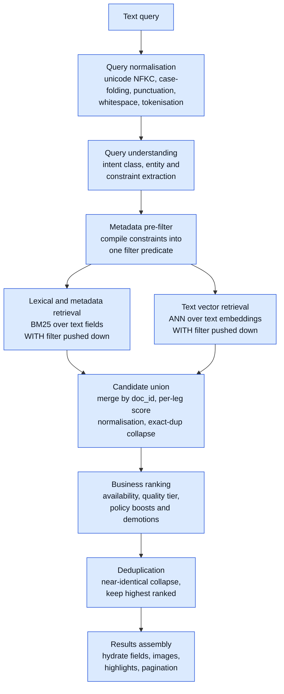
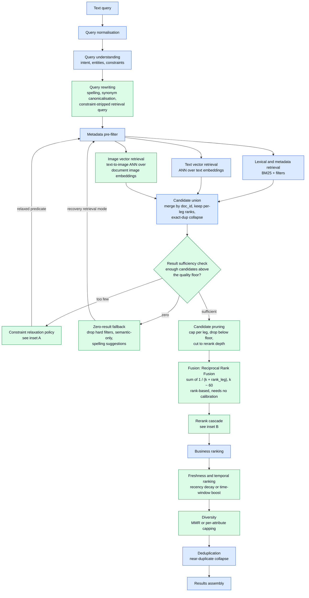
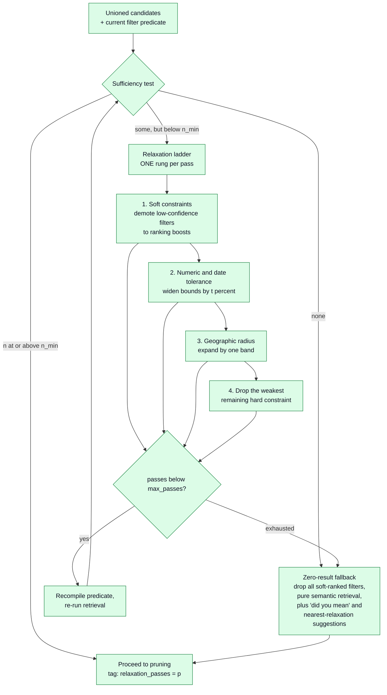
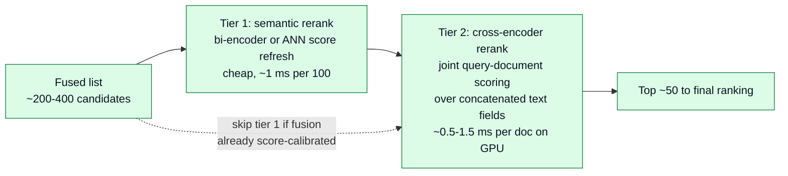
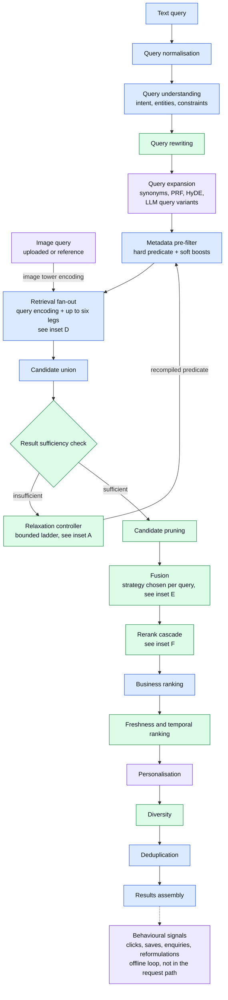
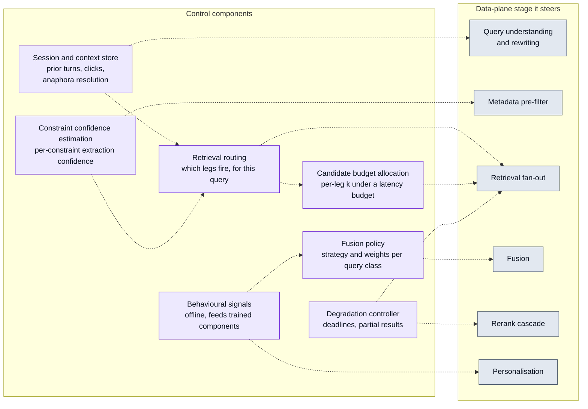
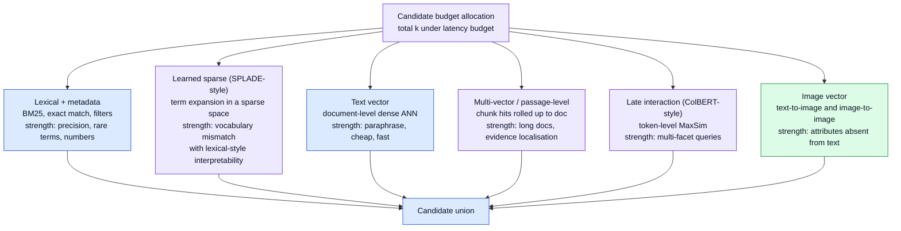
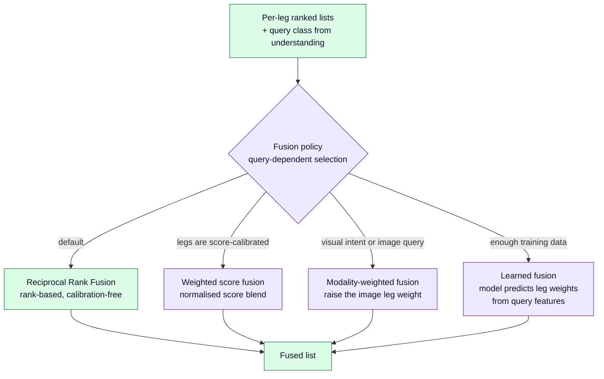
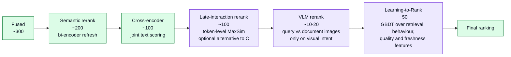

# Query Search Pipeline — Progressive Reference Templates

Synthesis and reconciliation of [2a](2a-search-query-pipeline-diagrams-opus5.md) and
[2b](2b-search-query-pipeline-diagrams-gpt5.md), against the component list in
[1](1-search-query-pipeline-components-list.md).

Three progressive reference templates for a **query-time** search pipeline over a corpus where each
document has:

- **text fields** — title, description, free-form body, possibly multiple language variants
- **metadata** — categorical (tags, type, status), numeric (price, size, count), temporal
  (created, updated), geographic (point or region)
- **an associated set of images** — 1..N per document, unordered, of varying quality and relevance

Indexing, embedding generation, ingestion and freshness of the indexes are **out of scope**.

---

## How to use these templates

These are not three designs to choose between. They are one design at three levels of commitment:

| Template                          | What it is                                  | Use it to                                                        |
| --------------------------------- | ------------------------------------------- | ---------------------------------------------------------------- |
| **1. Core**                       | Irreducible hybrid path                     | Agree on the spine. Ship it. Establish the eval harness.          |
| **2. Core + recommended**         | The actual production target                | Architect against this. It is the default answer.                 |
| **3. Full surface**               | The menu of everything                      | Argue about what to add, and when. **Not** a build target.        |

Template 3 is deliberately over-complete. Every purple node is a cost — latency, infra, a model to
maintain, a hyperparameter to tune, a new way to regress. The value of drawing it is to make the
*decision* explicit, not to build it.

**Read each template as three artefacts:** the diagram (structure), the stage contract (what flows
between boxes), and the failure table (what you are buying by adding the stage).

### Legend

| Style  | Meaning                                                    |
| ------ | ---------------------------------------------------------- |
| Blue   | `core` — minimum viable pipeline                           |
| Green  | `recommended` — expected in a competent production system  |
| Purple | `optional` — added for quality, scale, or specific domains |
| Dashed | control plane — steers a stage rather than transforming candidates |

### Assumed offline state

- Lexical + metadata index built, with **filterable** fields (not just searchable ones)
- Text embedding index — document-level, passage-level, or both
- Image embedding index — one vector per image, with a `doc_id` rollup rule
- Text and image encoders in a **shared or bridged space** (CLIP/SigLIP-style dual tower), which is
  what makes text-driven image retrieval possible without an image query
- Optional: learned sparse (SPLADE-style) index, multi-vector (ColBERT-style) index

> **Cross-modal assumption is load-bearing.** If your image embeddings are *not* in a space
> reachable from a text query, `Image vector retrieval` collapses from a recommended component to
> an optional one that only fires when the user uploads an image. Confirm this before designing
> around it — it is the single assumption most likely to be wrong in a first build.

### Running example

Used throughout to keep abstract stages legible. Illustrative only — substitute your domain.

```text
Query: "quiet waterfront cabin with a wood fireplace, sleeps 6,
        under $300 a night, within 2 hours of the city"
```

It exercises every interesting stage:

| Fragment                  | What it is                        | Which stage handles it                    |
| ------------------------- | --------------------------------- | ----------------------------------------- |
| `sleeps 6`                | hard numeric constraint           | metadata pre-filter                       |
| `under $300 a night`      | hard numeric range                | metadata pre-filter, range widening        |
| `within 2 hours of the city` | soft geo constraint, ambiguous unit | geo broadening, constraint confidence     |
| `waterfront`              | metadata tag **or** visual attribute | lexical + image vector retrieval         |
| `wood fireplace`          | visual attribute, often absent from text | image vector retrieval, VLM rerank   |
| `quiet`                   | subjective, evidence lives in reviews | text vector / late interaction         |

Note that the query has **six facets**. That is the fact that later justifies late interaction and
passage-level retrieval — a single dense document vector averages all six into mush.

---

## Template 1 — Core

The smallest pipeline that is genuinely hybrid: one lexical leg, one dense leg, a filter that is
applied *inside* both, and business rules on top.



### Decisions you are making here

| Decision | Options | Default and why |
| --- | --- | --- |
| Query understanding mechanism | rules/grammar · classifier · LLM extraction | **Start with rules + a small classifier.** An LLM in the hot path costs 100-400 ms and makes every downstream stage non-deterministic. Move to LLM only once you can cache it and have an eval set that proves it helps. |
| Filter application | pre-filter (pushed into the index) · post-filter (applied to top-k) | **Pre-filter, always.** Post-filtering a top-100 ANN result with a 2%-selective predicate leaves you ~2 results. This is the most common silent recall bug in hybrid search. |
| Where filtering happens for ANN | native filtered-ANN · pre-computed allow-list · partitioned index | Depends on your vector store. Verify it does *filtered* search, not filter-then-truncate. Benchmark recall at your real selectivity, not at 50%. |
| Union score handling | rank-only · min-max per leg · z-score per leg | **Min-max per leg, per query.** BM25 scores are unbounded and corpus-dependent; cosine is [-1,1]. They are not comparable. This is the weakest link in Template 1 and is what Template 2 replaces with RRF. |
| Dedup key | content hash · near-dup (SimHash/MinHash) · embedding threshold | Do exact-hash collapse at **union** (cheap, shrinks everything downstream); near-dup at **final ranking**. |

### Stage contract

The candidate record that flows from `Candidate union` onward. Fix this early — every later stage
appends to it rather than replacing it, and the provenance fields are what make the pipeline
debuggable.

```text
Candidate {
  doc_id
  per_leg: {
    <leg_name>: { rank, raw_score, normalised_score }   # provenance: which legs found it
  }
  evidence: { matched_fields, matched_terms, matched_image_ids }
  filter_state: { applied_constraints, relaxed_constraints }   # empty in T1
  scores: { union }                                             # T2 adds fused, rerank; T3 adds ltr
  final_rank
}
```

**Invariant:** never discard `per_leg`. "Which leg contributed the top-10" is the single most
useful diagnostic in the whole system, and you cannot reconstruct it after the fact.

### Dials

| Stage | Dial | Starting point |
| --- | --- | --- |
| Lexical retrieval | `k_lex` | 100–200 |
| Text vector retrieval | `k_vec` | 100–200 |
| ANN | `ef_search` / `nprobe` | tune to recall@100 ≥ 0.95 vs exact search |
| Union | output cap | 200–400 |
| Assembly | page size | 20 |

Rough p95 budget: normalise + understand 5–20 ms (rules) · retrieval legs in parallel 20–60 ms ·
union + ranking < 10 ms · hydration 10–30 ms. **Target ~150 ms p95.**

### Failure modes and what catches them

| Failure | Symptom | Metric that catches it |
| --- | --- | --- |
| Post-filtering instead of pre-filtering | Selective queries return near-empty; broad queries look fine | recall@k **bucketed by filter selectivity** |
| Over-constrained query | Zero results, no recovery | zero-result rate; zero-result rate by constraint count |
| Score scales incomparable | One leg dominates the top-10 regardless of query | per-leg contribution to top-10, by intent class |
| Understanding extracts a constraint that isn't one | Good documents filtered out silently | precision of constraint extraction on a labelled query set |
| Lexical leg tokenisation mismatch with index | Exact-match queries fail | exact-title-match probe suite (should be rank 1) |

`sleeps 6` and `under $300` become filter predicates; **everything else in the running example is
thrown away** by Template 1. `waterfront`, `wood fireplace` and `quiet` reach only the lexical and
dense-text legs, and none of the image evidence is consulted at all.

### Trigger to move on

Move to Template 2 when **any** of these is true — not on a schedule:

- zero-result rate > ~5% of queries
- per-leg contribution shows one leg supplying > 80% of the top-10
- nDCG@10 plateaus while recall@200 is materially higher (retrieval is fine; **ranking** is the bottleneck)
- users routinely search for attributes only visible in images

---

## Template 2 — Core + recommended

The production target. Adds rewriting, cross-modal image retrieval, a bounded relaxation loop,
principled rank fusion, a rerank cascade, and freshness/diversity.



### Inset A — the sufficiency and relaxation loop

The part of Template 2 most likely to be built wrong. It is a **bounded** loop with an **ordered**
ladder, and each pass must be recorded on the response.



**Ladder ordering is domain policy, not a technical choice.** The ordering above assumes that
loosening a *price ceiling* annoys users less than moving them to a different city. For the running
example, "within 2 hours of the city" is the natural first rung — it was never precise to begin
with; "sleeps 6" should be the last thing you touch, because it is a hard physical requirement and
relaxing it produces results the user cannot use.

**Non-negotiables:**

- `max_passes` ≈ 2. Each pass is a full retrieval round-trip; three passes blows any latency budget.
- Sufficiency is measured on **quality**, not just count: `n` candidates *above a score floor*.
  Twenty terrible matches are not sufficiency, they are a worse failure than zero results.
- Always tag the response with which constraints were relaxed. The UI must be able to say
  "no exact matches — showing places within 3 hours". Silent relaxation destroys trust, and it
  makes your offline eval unreproducible.

### Inset B — the rerank cascade

`Semantic rerank` and `Cross-encoder rerank` are **tiers of one funnel**, not two sequential
mandatory stages. Both source drafts chain them in a way that implies otherwise.



Depth funnel to hold in your head:

```text
retrieve  k=150 per leg   →  union ~300  →  prune 200
          → cross-encode top 100  →  final rank 50  →  display 20
```

Cross-encoder depth is **the** latency dial in this template. Cost is linear in depth; quality gain
is roughly logarithmic. 100 is a good default; measure nDCG@10 at depths 25/50/100/200 before
picking.

### Decisions you are making here

| Decision | Options | Default and why |
| --- | --- | --- |
| Fusion strategy | RRF · weighted score fusion · learned | **RRF, k≈60.** It needs no cross-leg score calibration, which is exactly the problem you have. Weighted score fusion is better *only* after you have per-corpus calibration and an eval set to tune on. |
| Where the constraint-stripped query goes | all legs · dense legs only | Send the **constraint-stripped** rewrite to the dense and image legs (`sleeps 6` pollutes an embedding) and the **full** query to the lexical leg (numbers are real lexical signal). This asymmetry is easy to miss and worth ~points of nDCG. |
| Image leg rollup | max over images · mean · top-2 mean | **Max**, usually — one strongly matching image (the wood fireplace) is the signal; averaging over 30 images of the same room buries it. Mean rewards documents with many images, which is a popularity proxy, not relevance. |
| Image leg weight | equal · down-weighted · query-dependent | Start **down-weighted**. Cross-modal similarity is noisier than text-to-text, and image legs produce confident-looking garbage for abstract queries (`quiet` has no visual referent). |
| Rewriting mechanism | dictionary/synonym map · seq2seq · LLM | Dictionary first. LLM rewriting is where a cache pays for itself — head queries repeat heavily. |
| Freshness | hard recency filter · decay multiplier · feature into ranking | Decay multiplier, tuned per intent class. Navigational queries want the canonical document, not the newest one. |
| Diversity | MMR · per-attribute cap · none | Per-attribute capping is cruder than MMR but far easier to explain to stakeholders and to debug. |

### Stage contract additions

```text
Candidate {
  ...as Template 1...
  per_leg: { lexical, text_vector, image_vector }        # image_vector adds matched_image_ids
  filter_state: {
    applied_constraints,
    relaxed_constraints: [ {name, from, to, ladder_rung, pass} ]
  }
  scores: { union, fused_rrf, rerank_semantic, rerank_cross, business, freshness, final }
}

Response {
  candidates,
  relaxation_passes,          # surfaced to the UI
  degraded_legs,              # legs that timed out; see cross-cutting
  timings_per_stage
}
```

**Scores are appended, never overwritten.** You want to be able to answer "this document was rank 3
in the lexical leg, 41 after fusion, 2 after cross-encoding, 8 after business rules" without a
re-run.

### Dials

| Stage | Dial | Starting point |
| --- | --- | --- |
| Retrieval | `k` per leg | 100–200 (equal to start; make it query-dependent in T3) |
| Sufficiency | `n_min`, score floor | `n_min` ≈ 3× page size; floor from the score distribution of judged-relevant docs |
| Relaxation | `max_passes` | 2 |
| Pruning | union cap | 200–400 |
| Fusion | RRF `k` | 60 (insensitive between 20 and 100; don't over-tune it) |
| Cross-encoder | depth | 100 |
| Diversity | per-attribute cap | max 3 per group in the top 20 |

Rough p95 budget for a ~400 ms target:

| Stage | p95 |
| --- | --- |
| Normalise + understand + rewrite (cached) | 10–30 ms |
| Query embedding (text tower + image tower) | 5–20 ms |
| Three retrieval legs, parallel | 30–80 ms |
| Union + sufficiency + prune | < 10 ms |
| RRF | < 5 ms |
| Cross-encoder, depth 100 | 60–150 ms |
| Final ranking | < 10 ms |
| Hydration | 20–40 ms |

A relaxation pass adds a full retrieval round-trip (~50–100 ms). Two passes plus a cross-encoder is
how you accidentally ship a 700 ms p99.

### Failure modes and what catches them

| Failure | Symptom | Metric that catches it |
| --- | --- | --- |
| Relaxation fires too eagerly | Results look broad and vague; users reformulate | relaxation rate by query class; reformulation rate |
| Relaxation is silent | Complaints that filters "don't work" | (no metric will save you — this is a UI contract, enforce it in the response schema) |
| Cross-encoder overturns a good fused list | nDCG@10 down while recall@100 unchanged | nDCG@10 **with and without** rerank, on the same candidate set |
| Image leg injects irrelevant documents | Visually similar, semantically wrong results | per-leg precision@10 on abstract vs concrete queries |
| RRF flattens a strong single-leg signal | Exact-match queries no longer rank 1 | exact-match probe suite; monitor as a hard gate |
| Rewriting changes intent | Head-query regressions after a rewrite-model change | before/after nDCG on a frozen head-query set |
| Rerank latency spikes on long documents | p99 latency far above p95 | rerank latency by document token length |

**Eval scaffolding worth building at this stage — not later:**

- A labelled set of 200–500 queries with graded relevance, **pooled across legs** so recall is
  measurable rather than assumed
- Deterministic replay: fix the candidate set, vary only fusion or rerank
- Per-leg ablation runs in CI — turn each leg off and record the nDCG delta. A leg that costs 40 ms
  and buys 0.005 nDCG is a leg to delete
- A probe suite of ~30 queries with known-correct rank-1 answers, as a regression gate

### Trigger to move on

- Queries are multi-faceted and long, and cross-encoding cannot fix what retrieval never found
  (→ passage-level / late interaction)
- One fusion weighting is demonstrably wrong for a whole query class (→ query-dependent fusion)
- Visual attributes drive conversion but text rerank cannot see them (→ VLM rerank)
- The tail of rare/vocabulary-mismatched queries is large (→ learned sparse, query expansion)
- You have enough behavioural data to train on (→ LTR, learned fusion, hard-negative mining)

---

## Template 3 — Full surface

Everything on the menu. The main flow below is the **data plane** — the stages that actually
transform candidates.

**Do not read this as "execute every box".** A simple navigational query should activate two legs,
skip fusion policy entirely, and never see a VLM.



The layer that decides *how* this flow behaves for a given query is drawn separately in inset C.
That separation is the main thing Template 3 has to teach: most of the optional components are
**control, not transformation** — they change which legs fire, how deep they go, and how results are
combined, rather than transforming candidates themselves.

### Inset C — the control plane



A control-plane bug fails **silently, as a quality regression** rather than as an error — a routing
rule that never fires the image leg looks exactly like a corpus problem. Log the routing decision,
the allocated budget, and the chosen fusion strategy on every single query.

### Inset D — retrieval fan-out

Six retrieval families. Almost nobody should run all six. Routing picks a subset; budget allocation
decides how deep each one goes.

Encode the query **once** — text tower for the dense text legs and the cross-modal image leg, image
tower for an uploaded image query — and share the vectors across every leg that needs them.
Re-encoding per leg is a common and entirely avoidable latency cost.



Choosing among them:

| Leg | Add it when | Real cost |
| --- | --- | --- |
| Lexical | always | — |
| Text vector | always | — |
| Image vector | attributes live in images, or users search visually | second encoder, image index, rollup policy |
| Learned sparse | large vocabulary-mismatch tail; you want dense-like recall with lexical-like debuggability | separate index, slower queries than BM25, expansion tuning |
| Multi-vector / passage | documents are long and heterogeneous; the answer lives in one section | chunking strategy becomes a hyperparameter; index size ×N chunks; rollup policy |
| Late interaction | queries are genuinely multi-faceted (the running example is) and a single vector averages facets away | 10–100× index size, or restrict to reranking a shortlist |

See [3-colbert-late-interation-models.md](3-colbert-late-interation-models.md) for the late
interaction vs chunking trade-off in depth. The short version for this document: **late interaction
and passage-level retrieval attack the same problem** (one document vector cannot represent six
facets) from opposite ends. Passage retrieval splits the document; late interaction splits the
representation. Pick one deliberately; running both is usually redundant spend.

Practically, late interaction is often better deployed as a **reranker over the fused shortlist**
than as a first-stage retriever — you get most of the quality without the index blowup. That
placement ambiguity is why it appears in this inset and again in the rerank cascade.

### Inset E — fusion as a policy, not a chain

Both source drafts draw `Fusion → RRF`, which reads as two sequential stages. It is one stage with a
strategy slot.



`Query-dependent fusion` is the **selector**, not a sibling strategy. `Learned fusion` replaces the
hand-written selection rules with a model in the same slot. Modality weighting is the specific case
that matters for an image-bearing corpus: for `wood fireplace` the image leg should dominate; for
`quiet` it should be nearly muted.

### Inset F — full rerank cascade

A funnel with shrinking width and rising cost per document.



- **VLM rerank** is 50–500 ms per call. It sees the top 10–20 only, and only when the query has
  visual intent. Gate it on routing, cache aggressively, and be ready to drop it under load.
- **LTR** sits *after* the neural rerankers because its most valuable features are their scores.
  It is the natural place to blend relevance with behaviour and business signals — which means the
  boundary between LTR and `Business ranking` becomes a policy decision about what you are willing
  to let a learned model trade away. Keep hard business rules (compliance, availability) out of the
  model.
- Each tier must be independently skippable under a deadline.

### Optional components: when they earn their place

| Component | Add when | Watch out for |
| --- | --- | --- |
| Query expansion (PRF/HyDE/LLM) | large vocabulary-mismatch tail | query drift; expansion helps recall and often hurts precision. Measure both. |
| Session/context-aware | multi-turn or refinement-heavy UX | stale context "sticking" to an unrelated new query; needs an explicit reset heuristic |
| Retrieval routing | legs have materially different cost and your query mix is heterogeneous | a routing bug fails *silently* as a quality regression, not an error. Log the chosen route on every query. |
| Budget allocation | you are latency-bound and want quality where it matters | interacts with routing; tune them together or not at all |
| Constraint confidence | extraction is noisy and over-filtering is a known problem | needs calibration; an uncalibrated confidence is worse than a threshold |
| Personalisation | you have identity and enough per-user history | filter bubbles; always reserve slots for unpersonalised results, and hold out a control |
| Learned fusion / LTR | ≥ tens of thousands of labelled or behavioural judgements | position bias in click data — debias or you will train the model to reproduce your current ranking |
| Hard-negative mining | you are training your own retrievers | false negatives (unlabelled relevant docs) mined as hard negatives are actively harmful |

---

## Where 2a and 2b disagree, and how to resolve it

Genuine structural disagreements between the two source drafts, and the position taken here.

| # | Question | 2a | 2b | Position taken here |
| --- | --- | --- | --- | --- |
| 1 | Normalisation vs understanding order | normalise → understand | understand → normalise | **Normalise first.** It is deterministic and cheap, it makes understanding stable and cacheable, and understanding is the stage you may later replace with a model. |
| 2 | Sufficiency check placement | after retrieval legs, before union | after union **and** pruning | **After union, before pruning.** You need deduplicated counts, but score-floor pruning can drop candidates below the threshold and mask a shortfall as sufficiency. |
| 3 | Zero-result fallback re-entry | routes forward into `Candidate union` | routes back into pre-filter/routing | **Back into retrieval** (2b). Fallback is a distinct retrieval *mode* — drop hard filters, go semantic-only. Routing it forward into union means it never actually retrieves anything. |
| 4 | Fusion → RRF | drawn as sequential stages | drawn as sequential stages | **One stage, strategy slot** (Inset E). The chained reading invites building two stages. |
| 5 | Semantic → cross-encoder rerank | sequential | sequential, with a VLM branch | **Cascade tiers** (Inset F), each independently skippable, with an explicit depth funnel. |
| 6 | Late interaction placement | notes it can be retriever or reranker | first-stage retriever only | **Default to reranker**, promote to retriever only if you accept the index cost. |
| 7 | Deduplication | single stage at the end | single stage at the end | **Split it.** Exact-hash collapse at union (cheap, shrinks everything downstream); near-duplicate collapse at final ranking. |
| 8 | Image query routing | encodes, then feeds the image leg | feeds both routing and the image leg | **Both** (2b). An image query is a routing signal *and* a retrieval input. |

---

## Cross-cutting concerns

Not stages. They apply to all three templates and are the difference between a diagram and a system.

**Deadlines and graceful degradation.** Every retrieval leg gets an independent deadline. On expiry
the pipeline proceeds with whatever returned, tagging `degraded_legs` on the response. A search that
returns good-enough results in 300 ms beats one that returns perfect results in 2 s, and beats a
500 error absolutely. Decide the degradation order in advance: VLM first, then cross-encoder depth,
then the slowest retrieval leg. Never silently degrade without recording it — otherwise your
latency win shows up as an unexplained relevance regression.

**Caching, by TTL.**

| What | TTL | Note |
| --- | --- | --- |
| Normalisation + understanding | hours–days | Deterministic given the input string. Highest-value cache if understanding is an LLM. |
| Query embeddings | days | Keyed on the normalised, rewritten string. Invalidate on model version. |
| Retrieval results | seconds–minutes | Only if corpus freshness allows. Key must include the filter predicate. |
| Rerank scores | minutes–hours | Keyed on (query, doc_id, model version). Head queries hit hard. |
| VLM rerank | hours–days | Expensive enough to justify a persistent cache. |

Every cache key must include the model/config version, or a deployment silently serves stale scores.

**Observability.** The per-stage metrics that make regressions debuggable:

- candidate count in/out of every stage (a stage that drops 90% of candidates is either your best
  filter or your worst bug)
- per-leg contribution to the final top-10, sliced by intent class
- relaxation pass counts and which rungs fired
- routing decisions, when routing exists
- latency per stage at p50/p95/p99, plus timeout counts per leg
- rank churn between stages — how much each stage reorders the list. **A stage that reorders almost
  nothing is a stage to delete.**

**Evaluation.** Offline is a gate; online is the truth.

| Layer | Metric |
| --- | --- |
| Retrieval | recall@k per leg and pooled; bucketed by filter selectivity |
| Fusion | nDCG@10 on a fixed candidate set (isolates fusion from retrieval) |
| Rerank | nDCG@10 with/without, at several depths |
| End to end | nDCG@10, MRR, zero-result rate, p95 latency |
| Guardrail | exact-match probe suite as a hard CI gate |
| Online | CTR@k, save/enquiry rate, reformulation rate, abandonment, session success |

The feedback components in the component list (click, save/enquiry, reformulation signals,
hard-negative mining) are the **input** to this layer, not pipeline stages. They close the loop:
behaviour → labels → LTR/learned fusion/retriever fine-tuning → pipeline. Instrument them from day
one even if nothing consumes them yet; you cannot retroactively collect the data, and it is the
gating dependency for half of Template 3.

---

## Build order

Ordered by (value delivered ÷ cost), with the trigger that says "now".

| Step | Build | Trigger to start | What it buys |
| --- | --- | --- | --- |
| 0 | Eval harness: labelled queries, replay, probe suite | before anything else | every later decision becomes measurable instead of arguable |
| 1 | Template 1 spine, filters pushed down | — | a working baseline and honest numbers |
| 2 | Fusion (RRF) replacing weighted union | one leg dominates the top-10 | removes score-calibration guesswork |
| 3 | Cross-encoder rerank | nDCG plateaus while recall@200 is higher | usually the largest single relevance jump in the whole list |
| 4 | Sufficiency + bounded relaxation + zero-result fallback | zero-result rate > ~5% | recovers the queries you are currently losing entirely |
| 5 | Image vector retrieval | users search for attributes only visible in images | unlocks the modality you already have indexed |
| 6 | Freshness, diversity, near-dup | top-10 is repetitive or stale | perceived quality, cheap to add |
| 7 | Query rewriting | spelling/synonym failures show in the reformulation rate | tail recovery |
| 8 | Behavioural instrumentation | as soon as you have traffic | the dependency for everything below |
| 9 | Routing + budget allocation | latency-bound with a heterogeneous query mix | buys headroom to spend on quality where it matters |
| 10 | Passage-level **or** late interaction | multi-faceted queries over long documents | fixes what rerank cannot: candidates never retrieved |
| 11 | Query-dependent / modality-weighted fusion | one weighting is provably wrong for a query class | per-class gains |
| 12 | VLM rerank | visual intent drives conversion | high cost, narrow gate |
| 13 | LTR / learned fusion / personalisation | tens of thousands of judgements | compounding gains, high maintenance |

Steps 1–7 are Template 2. Most systems should stop there and spend the remaining effort on data
quality, the eval set, and the index — which is where the returns usually are.

---

## Open questions to settle before architecting

1. **Is the image space text-reachable?** Determines whether the image leg is recommended or
   optional. Verify before designing around it.
2. **How many images per document, and what is the rollup?** Max vs mean changes which documents win.
3. **Are documents long and heterogeneous?** Decides whether passage-level retrieval is mandatory
   rather than optional.
4. **How selective are the filters in practice?** Drives the pre-filter implementation and the
   entire relaxation design. Get the real selectivity distribution from query logs.
5. **What is the latency budget, and who owns it?** Cross-encoder depth and VLM rerank are decided
   by this number and nothing else.
6. **Is there behavioural data today?** If not, everything learned in Template 3 is at least two
   quarters away, and step 8 moves to the front.
7. **What must never be relaxed?** The relaxation ladder is a product decision. Get it in writing
   before it becomes an incident.
