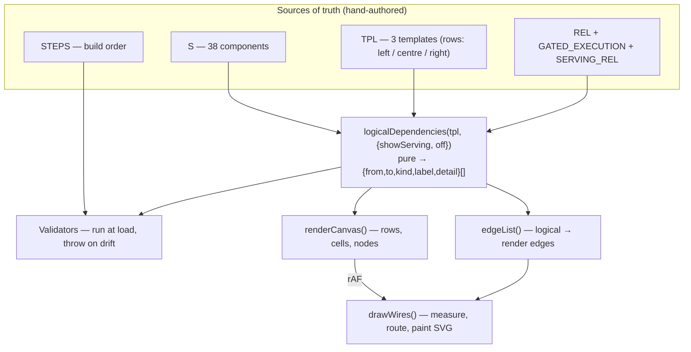
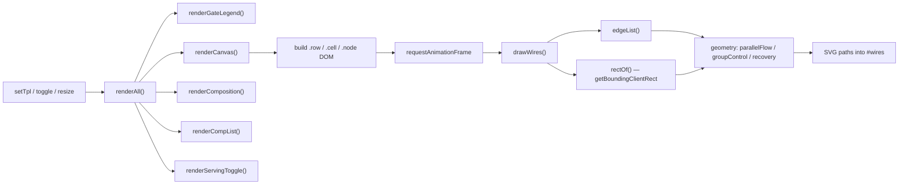

# search-query-pipeline-diagram-tool — architecture

How `search-query-pipeline-diagram-tool.html` is built, for a human or agentic engineer
about to change it.

## What it is

A single-file, zero-build interactive explorer for the **logical** architecture of a
query-time search pipeline: 38 components, three progressive levels (Core / Core +
recommended / Full surface), an optional serving-data layer, and three views (Pipelines,
Build order, About).

Open the file directly in a browser — no bundler, no server, no package manager. There are
**no** `fetch`, `import`, `require`, `localStorage` or `sessionStorage` calls anywhere. The
only runtime network dependency is the Google Fonts stylesheet in `<head>`, which degrades
to system fonts offline; every other URL is a reference `href`.

**The invariant to internalise:** the diagram, sidebar metrics, hover card and detail
drawer are all _derived from the same data structures_. Nothing about the pipeline is
encoded in markup. If you are hand-writing a node or an edge into HTML, you are working
against the design.

## File regions

The file is three blocks: CSS, static markup, script. Line numbers are indicative — the
`/* ===== BANNER ===== */` comments in the script are the durable landmarks.

| Lines     | Region                             | Contents                                                     |
| --------- | ---------------------------------- | ------------------------------------------------------------ |
| 1–9       | `<head>`                           | Meta, title, Google Fonts link                               |
| 10–775    | `<style>`                          | Theme tokens + 13 commented sections                         |
| 777–1009  | markup                             | Header/tabs, the three `.view` sections, the drawer shell    |
| 1013–1045 | `FACETS`, `CAPS`                   | Worked-example facets; capability taxonomy                   |
| 1046–1851 | **component registry**             | 38 `def({...})` calls into `S`                               |
| 1852–2055 | `REFS`                             | Background reading, keyed by component id                    |
| 2056–2117 | completeness pass                  | `EXAMPLES` / `DIALS` / `FAILS` merged onto `S`               |
| 2118–2204 | `BRANCHES`, `TPL`                  | The three pipeline templates (row layout)                    |
| 2205–2285 | `DATA_SOURCES`, `SERVING_REL`      | Serving layer + derived reverse index `RSERVING`             |
| 2286–2511 | gates + `REL` + `RELATION_TYPES`   | Relationship model; derived reverse index `RREL`             |
| 2512–2975 | `DEPENDENCY_BASELINE` + validators | The invariant wall (see below)                               |
| 2979–3087 | `STEPS` + ladder validator         | Build order view data                                        |
| 3089–3144 | state + DOM helpers                | `state`, `$`, `$$`, on/off predicates                        |
| 3145–3211 | composition model                  | Phase mix, complexity, model count                           |
| 3212–3448 | node rendering                     | `nodeEl`, `dataSourceEl`, narrow-screen fallbacks            |
| 3449–4039 | **canvas render + wires**          | `renderCanvas`, render targets, geometry, `drawWires`        |
| 4040–4121 | focus                              | Facet / capability / gate tracing                            |
| 4122–4326 | drawer                             | `openDrawer`, `openSourceDrawer`                             |
| 4327–4458 | hover preview                      | Desktop-only four-field card                                 |
| 4459–4532 | list + build views                 | `renderCompList`, `renderBuild`                              |
| 4533–4646 | wiring                             | `renderAll`, `setTpl`, `setView`, event listeners, bootstrap |
| 4647–4744 | layout diagnostics                 | `window.dependencyDiagnostics`                               |

## Layers

## The five sources of truth

**`S` — the component registry.** `def({...})` writes into the flat map `S`, keyed by id.
Every component carries `id, name, group, tier, intro, sub, cx, purpose, decisions,
contract`; most also carry `failures, notes, caps, dials, example`. Optional markers:
`model` (model in the request path), `control` (control plane), `parallel` (fan-out group
member), `io`, `conditional`/`conditionalOn`, `handles` (facet ids). `tier` ∈
`core | recommended | optional` and `intro` ∈ `1 | 2 | 3` are perfectly correlated by
design — `tier` is the text reading of the node colour.

**`TPL` — the three templates.** Each is a list of rows shaped
`{l:[left aside], c:[centre spine], r:[right control], nextLabel}`. **Only the centre spine
generates flow edges**; a component in `l` or `r` sits on the row where it is produced and
reaches consumers through `REL`. `extra` carries the branch/loop edges (`BRANCHES`).

**`REL` — component relationships.** Nine source components declaring `steers` / `feeds` /
`trains` / `updates` targets. `RELATION_TYPES` is the registry of all nine edge kinds
(`flow, gated, branch, loop, steers, feeds, trains, updates, serves`) and owns each kind's
colour, dash, marker, routing strategy, ARIA label and legend copy — add a kind there and
legend, wires and drawer all follow. `RREL` is the derived reverse index.

**`GATED_EXECUTION` — gates.** A gate is an _execution condition_, not a relationship.
`GATE_KINDS` declares who decides (`route`/`intent` per request, owned by `routing`;
`config` as a standing deployment choice) and `defGate()` resolves each entry against that
registry **at definition time**, so an unknown kind throws on load rather than printing
`undefined` onto a card.

**`SERVING_REL` — the data plane.** Maps each logical index/store to the components it
serves. `RSERVING` is derived, and each source's `tier`/`intro` is _computed_ from the
minimum `intro` of its consumers — so a source never appears before the component needing it.

## Rendering

The single most important structural idea: **logical edges and drawn edges are different
things.** `logicalDependencies()` is pure and geometry-free — it returns the full logical
inventory. `edgeList()` then collapses that inventory into _render edges_ aimed at **render
targets**, of which there are four types: `node`, `group` (a padded box around a parallel
fan-out row), `stage-group` (e.g. the selective rerank cascade), and `source`. One drawn
wire may stand for many logical relationships — that is why the validators assert against
the logical inventory and never against the SVG.

`drawWires` **measures the live DOM**, so it must run after layout — hence the
`requestAnimationFrame` hop, the `ResizeObserver` on the canvas, the resize listener, and
the `document.fonts.ready` re-draw. Any change that alters node size must end in a
`drawWires()`.

`state` is a single plain object: `{view, tpl, prevTpl, showServing, off:{1:Set,2:Set,3:Set},
collapsedGroups, sel, focus}`. Note `off` is **per template** — switching levels preserves
each level's composition. There is no persistence and no URL state (both are open TODOs).

CSS is minimal-contract: theme tokens on `:root` with a `[data-theme="dark"]` override,
tier and wire colours as variables (`--core-bg`, `--wire-train`, `--gate-request`, …).
The JS depends on the class and data-attribute contract — `.node[data-id]`,
`.data-source-node[data-source-id]`, `.row[data-row]`, `.cell.center` — so rename those
with care.

## The validator wall

Three validators run **at module load** and `throw` on drift. A throw kills the entire
script and the page renders as a dead shell — so a failing validator is loud, not subtle.
Check the browser console first when the page looks empty.

- `validateDependencyBaseline()` — asserts the full logical dependency inventory for all
  three templates, with and without the serving layer, against the hand-maintained
  `DEPENDENCY_BASELINE` fixture. Also asserts three behavioural invariants: showing sources
  adds _only_ `serves` edges; disabling a component removes _every_ edge incident on it;
  a data source goes inactive when all of its consumers do. It additionally checks
  hardcoded source/edge counts per template.
- `validateRelationshipModel()` — every id in `REL`/`SERVING_REL` exists, no duplicate
  relations, every declared kind is used, marker colours are consistent.
- `validateBuildLadder()` — every component has exactly one build step, no component is
  built twice, each step's `t` matches the highest `intro` it introduces. `q-text` is the
  sole exempt component (the query arrives; it is not built).

`window.dependencyDiagnostics` exposes `inventory()`, the three validation summaries, and
`layoutReport()` / `layoutSweep()` for geometry snapshots. Use it from the console rather
than reading the SVG.

## Recipes

**Add a component.**

1. `def({...})` in the registry, in its group's section. Set `tier` and `intro`
   consistently (`core`→1, `recommended`→2, `optional`→3).
2. Add its id to the appropriate row of every `TPL` at or above its `intro` — `c` for the
   spine, `l` for a left aside, `r` for a right control.
3. Add a `STEPS` entry (or extend an existing step) — the ladder validator requires exactly
   one, and the step's `t` must equal the highest `intro` it introduces.
4. Update `DEPENDENCY_BASELINE` for every affected template, and the hardcoded
   `expectedSourceCounts` / `expectedServingCounts` if the serving layer changed.
5. Optionally add `REFS`, `EXAMPLES`, `DIALS`, `FAILS` entries keyed by the same id.
6. Reload; a validator throw will name exactly what is missing.

**Add a relationship between existing components.** Add the target id to the source's
`steers`/`feeds`/`trains`/`updates` array in `REL`, then add the matching triple to
`DEPENDENCY_BASELINE` for each template where both endpoints are active. `RREL`, the
drawer's dependency sections, the hover card and the wires all follow automatically. If the
relationship carries data the reader cannot infer, add a `RELATION_DETAILS` entry
(`"from|kind|to"`) giving `label`, `payload`, `cadence`.

**Add a new relation kind.** Add an entry to `RELATION_TYPES` with its full visual and
copy contract (`fwd`, `rev`, `description`, `aria`, `color`, `dash`, `marker`, `route`,
`componentRelation`, `legend`). Define the colour token in both theme blocks. Set
`componentRelation:true` if it should participate in `REL` and the reverse index.

**Gate a component.** Add `GATED_EXECUTION[id] = defGate(fromTemplate, kind, condition)`
using a `kind` and `condition` already declared in `GATE_KINDS` — or declare the new
condition there first. Gated spine edges automatically render as `gated` rather than `flow`.
Update the baseline fixture, since edge _kinds_ are part of the asserted inventory.

**Add a data source.** Add to `DATA_SOURCES`, map it in `SERVING_REL` to its consumers,
then update `DEPENDENCY_BASELINE`'s `serves` list and the expected source/edge counts. Do
not set the source's `tier`/`intro` — they are derived from its consumers.

## Gotchas

- **The baseline fixture is hand-maintained.** It is the point of the design — it protects
  the logical inventory from silent drift — but it means every structural change is a
  two-place edit. Expect the first reload after a change to throw.
- **Row position is layout, not semantics.** Moving a component between `l`/`c`/`r` changes
  which flow edges are generated. Only the centre spine chains.
- **Don't assert against the SVG.** Several logical edges deliberately collapse into one
  drawn path at group boundaries. Assert against `logicalDependencies()`.
- **Narrow screens take a different path.** Below 700px the tool renders textual dependency
  chips and transitions instead of wires (`mobileTransition`, `mobileRecovery`,
  `renderMobileSelection`). A crossing of that breakpoint triggers a full `renderAll`, not
  just a re-draw. Changes to relationship display usually need doing twice.
- **`search-query-pipeline-diagram-tool-surface.md`** is a point-in-time extraction, not a
  source of truth, and has already drifted (it lists seven retrieval legs; `LEGS` has six —
  late-interaction now lives in the rerank cascade). Regenerate rather than trust it.
- Outstanding direction is captured in `TODO.md` — notably URL-based state sharing, mermaid
  export, drag-and-drop reordering, and splitting the data structures out of the HTML.
